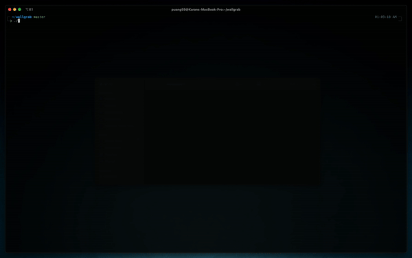

# wallgrab

This tool is designed to fetch and download wallpapers from [Wallhaven](https://wallhaven.cc) based on various user-defined parameters. It uses the Wallhaven API to search for wallpapers and downloads them to the user's local system.

##

<p align="center">

</p>

## Features

- **Interactive User Input**: The script prompts the user for various parameters like search query, categories, purity, sorting options, resolutions, and more.
- **Customizable Downloads**: Users can specify the number of wallpapers they want to download.
- **Flexible Parameters**: Supports a wide range of search parameters available on Wallhaven.

## Requirements

- `jq` (A lightweight and flexible command-line JSON processor)
- `wget` (For downloading the wallpapers)
- `curl` (For sending HTTP requests)

## How to Use

1. **Clone the Repository**:
   ```bash
   git clone https://github.com/puang59/wallgrab.git
   ```
2. **Navigate to the Directory**:

   ```bash
   cd wallgrab
   ```

3. **Make the Script Executable**:

   ```bash
   chmod +x wallgrab.sh
   ```

4. **Run the Script**:

   ```bash
   ./wallgrab.sh
   ```

5. **Follow the On-Screen Prompts**: Answer the prompts to specify your search criteria.

## Parameters

- **Query**: Enter keywords/tags for the wallpapers.
- **Categories**: Specify the categories (e.g., general, anime, people).
- **Purity**: Choose the purity level (e.g., sfw, sketchy, nsfw).
- **Sorting**: Select the sorting method (e.g., date added, relevance, random).
- **Order**: Choose the order (ascending or descending).
- **Top Range**: Specify the time range for top wallpapers (e.g., 1d, 3d, 1w).
- **At Least Resolution**: Specify the minimum resolution (e.g., 1920x1080).
- **Resolutions**: Specify resolutions (comma-separated).
- **Ratios**: Specify aspect ratios (e.g., 16x9, 16x10).
- **Colors**: Specify colors (comma-separated hex codes).
- **Page**: Specify the page number for pagination.
- **Seed**: (Optional) Specify a seed for random results.
- **Threshold**: Specify the number of wallpapers to download.

Note: Detailed description is available [here](https://wallhaven.cc/help/api)

## Output

The downloaded wallpapers will be saved in the `~/wallpapers` directory by default.
To change this behaviour, just modify [this line](https://github.com/puang59/wallgrab/blob/ad6beaca67fd572f08366e98a65a9efc56cfa1e9/wallgrab.sh#L27).

```bash
    mkdir -p ~/wallpapers
```

## License
This project is licensed under [GPL-3.0](./LICENSE).

